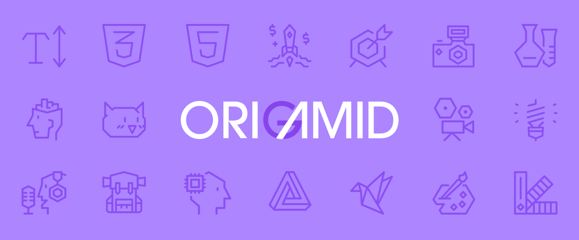

<h1>Cursos Origamid</h1>

<ul aria-label="Completos">
  <li> <strong>🎨 Tailwind CSS</strong></li>
  <li> <strong>🧱 HTML e CSS para Iniciantes</strong></li>
  <li> <strong>🧠 JavaScript Completo ES6</strong></li>
  <li> <strong>🗄️ Banco de Dados SQLite</strong></li>
</ul>

<ul aria-label="Cursando">
  <li> <strong>🔤 TypeScript para Iniciantes</strong></li>
</ul>

<ul aria-label="Futuros">
  <li> <strong>🖌️ UI Design para Iniciantes</strong></li>
  <li> <strong>📦 CSS Flexbox</strong></li>
  <li> <strong>📐 CSS Grid Layout</strong></li>
  <li> <strong>👩‍🎨 UI Design Avançado</strong></li>
  <li> <strong>⚛️ React Completo</strong></li>
  <li> <strong>🌐 WordPress REST API Dogs</strong></li>
  <li> <strong>🔧 React com TypeScript</strong></li>
  <li> <strong>🚀 Next.js</strong></li>
  <li> <strong>🧬 Redux com React</strong></li>
  <li> <strong>📝 WordPress como CMS</strong></li>
  <li> <strong>📏 CSS Avançado Posicionamento</strong></li>
  <li> <strong>🔠 Tipografia Avançada</strong></li>
  <li> <strong>💅 CSS com SASS</strong></li>
  <li> <strong>🤓 UX Design Heurísticas</strong></li>
  <li> <strong>🔌 WordPress REST API</strong></li>
  <li> <strong>🛒 WooCommerce como CMS</strong></li>
  <li> <strong>🥾 BootStrap 4</strong></li>
  <li> <strong>🤖 Automação Front End com NPM</strong></li>
  <li> <strong>🐚 JavaScript com jQuery</strong></li>
  <li> <strong>🌿 Vue.js 2 Completo</strong></li>
</ul>

<h2>📚 Todos os cursos são da <a href="https://www.origamid.com/" target="_blank" rel="noopener noreferrer">Origamid</a>, recomendo demais!</h2>
